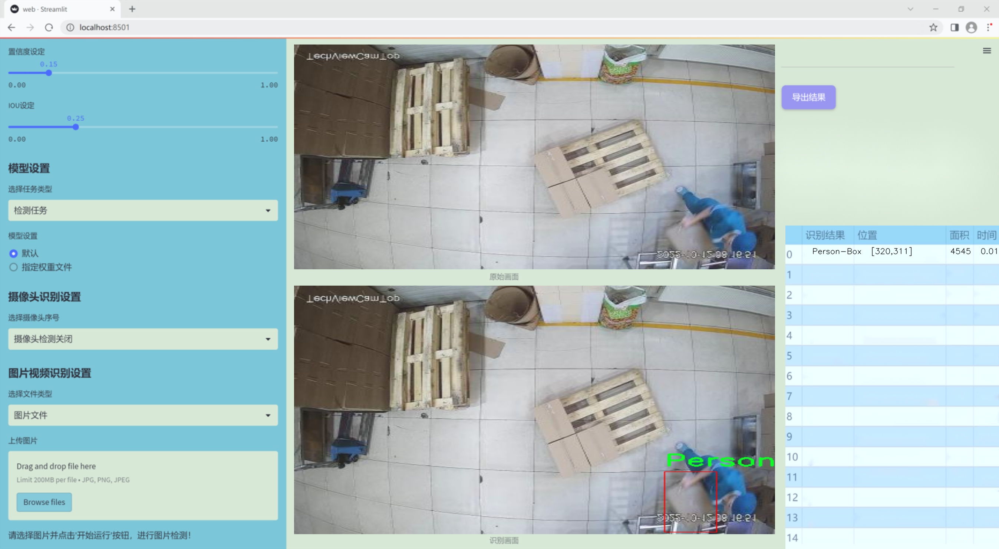
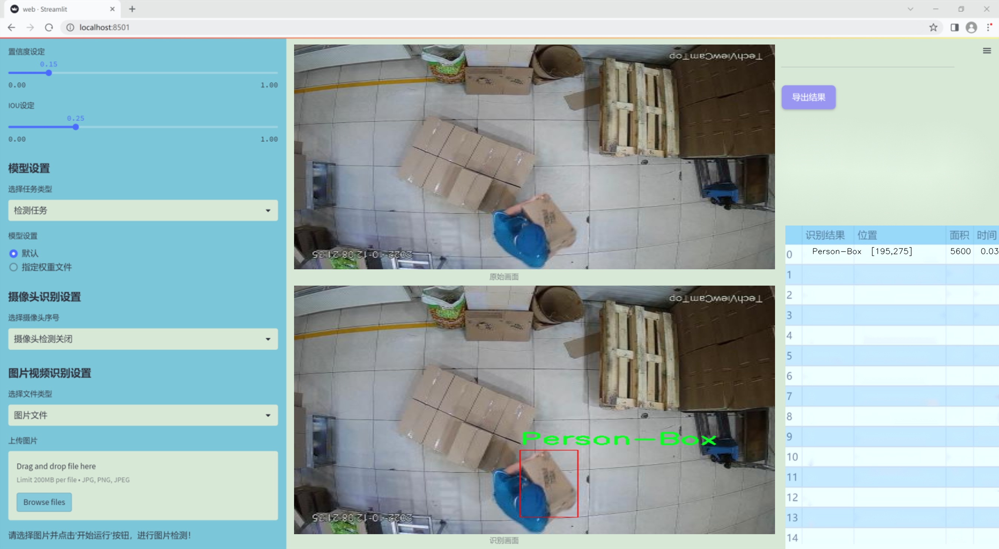
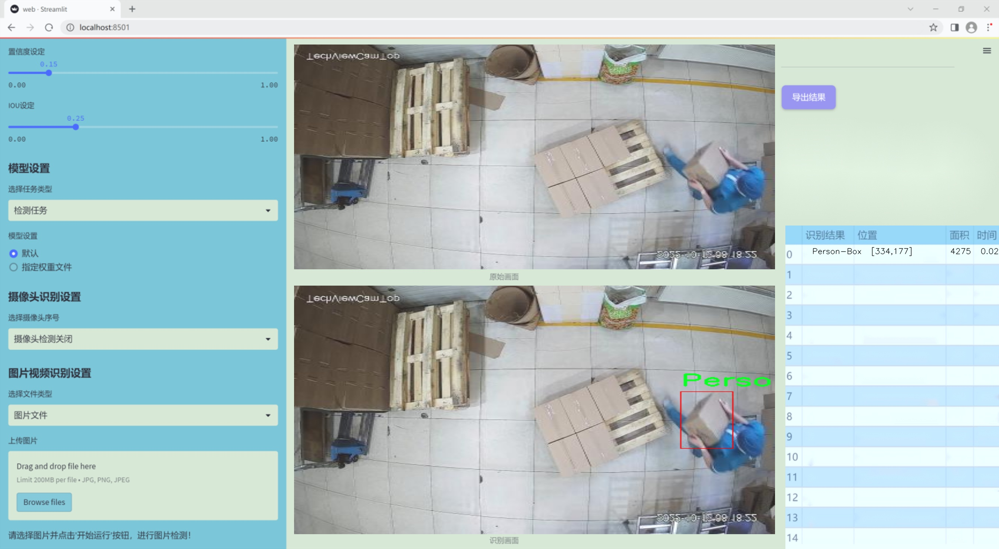
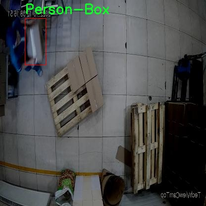
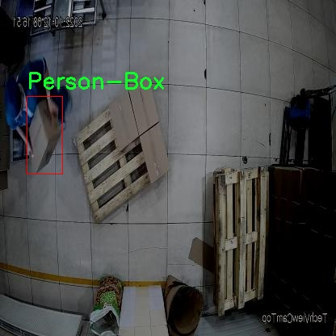
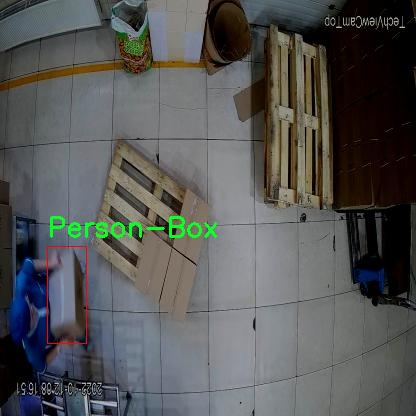
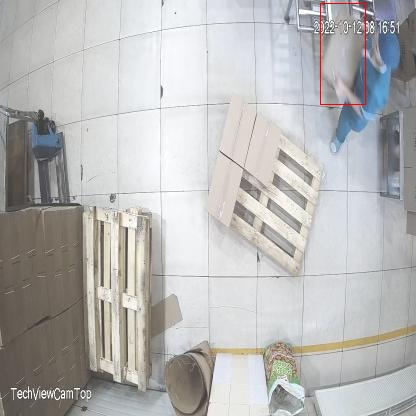
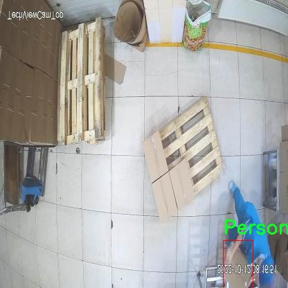

# 改进yolo11-HGNetV2等200+全套创新点大全：仓库箱体检测系统源码＆数据集全套

### 1.图片效果展示







##### 项目来源 **[人工智能促进会 2024.10.24](https://kdocs.cn/l/cszuIiCKVNis)**

注意：由于项目一直在更新迭代，上面“1.图片效果展示”和“2.视频效果展示”展示的系统图片或者视频可能为老版本，新版本在老版本的基础上升级如下：（实际效果以升级的新版本为准）

  （1）适配了YOLOV11的“目标检测”模型和“实例分割”模型，通过加载相应的权重（.pt）文件即可自适应加载模型。

  （2）支持“图片识别”、“视频识别”、“摄像头实时识别”三种识别模式。

  （3）支持“图片识别”、“视频识别”、“摄像头实时识别”三种识别结果保存导出，解决手动导出（容易卡顿出现爆内存）存在的问题，识别完自动保存结果并导出到tempDir中。

  （4）支持Web前端系统中的标题、背景图等自定义修改。

  另外本项目提供训练的数据集和训练教程,暂不提供权重文件（best.pt）,需要您按照教程进行训练后实现图片演示和Web前端界面演示的效果。

### 2.视频效果展示

[2.1 视频效果展示](https://www.bilibili.com/video/BV1991KYFE3L/)

### 3.背景

研究背景与意义

随着电子商务的迅猛发展，仓储物流行业面临着日益增长的管理和效率挑战。传统的仓库管理方式往往依赖人工操作，效率低下且容易出错，无法满足现代化仓储的需求。因此，如何利用先进的计算机视觉技术来提升仓库管理的智能化水平，成为了亟待解决的问题。近年来，目标检测技术的快速发展为这一问题提供了新的解决方案，其中YOLO（You Only Look Once）系列模型因其高效性和实时性而受到广泛关注。

本研究旨在基于改进的YOLOv11模型，构建一个高效的仓库箱体检测系统。该系统的核心任务是准确识别和定位仓库中的箱体，进而为后续的自动化管理提供数据支持。为实现这一目标，我们使用了名为“Box_Rec_11”的数据集，该数据集包含1800张图像，专注于“Person-Box”类别的目标检测。这一数据集的设计不仅涵盖了不同环境下的箱体图像，还考虑了箱体与人员的交互，为模型的训练和评估提供了丰富的样本。

通过对YOLOv11模型的改进，我们期望在提高检测精度的同时，缩短检测时间，从而实现实时监控和管理。该系统的成功实施将有助于提升仓库管理的自动化水平，降低人力成本，提高工作效率。此外，基于深度学习的目标检测技术在仓储领域的应用，能够为行业提供更为精准的数据分析和决策支持，推动智能仓储的发展。因此，本研究不仅具有重要的理论意义，也为实际应用提供了切实可行的解决方案，具有广泛的推广价值。

### 4.数据集信息展示

##### 4.1 本项目数据集详细数据（类别数＆类别名）

nc: 1
names: ['Person-Box']


该项目为【目标检测】数据集，请在【训练教程和Web端加载模型教程（第三步）】这一步的时候按照【目标检测】部分的教程来训练

##### 4.2 本项目数据集信息介绍

本项目数据集信息介绍

本项目所使用的数据集名为“Box_Rec_11”，旨在为改进YOLOv11的仓库箱体检测系统提供高质量的训练数据。该数据集专注于一个特定的类别，即“Person-Box”，这意味着数据集中包含的所有图像均围绕着一个主要的检测目标：与人相关的箱体。这一设计使得数据集在仓库环境下的应用尤为突出，能够有效地帮助模型识别和定位与人类活动相关的箱体，从而提升仓库管理的智能化水平。

“Box_Rec_11”数据集的构建经过精心策划，涵盖了多种不同的场景和光照条件，以确保模型在实际应用中的鲁棒性。数据集中包含了大量标注清晰的图像，涵盖了不同尺寸、形状和颜色的箱体，这些箱体在图像中与人类的互动关系被详细标注。通过这种方式，数据集不仅提供了丰富的视觉信息，还为模型的训练提供了多样化的样本，确保其在不同情况下的适应能力。

此外，数据集的设计考虑到了仓库环境的复杂性，包括拥挤的空间、不同的货物摆放方式以及可能出现的遮挡情况。这些因素都被纳入数据集的构建中，使得“Box_Rec_11”成为一个极具挑战性和实用性的训练资源。通过使用这一数据集，改进后的YOLOv11模型将能够更准确地识别和定位仓库中的箱体，进而提高整体的物流效率和安全性。综上所述，“Box_Rec_11”数据集为本项目的成功实施奠定了坚实的基础，确保了模型在实际应用中的有效性和可靠性。











### 5.全套项目环境部署视频教程（零基础手把手教学）

[5.1 所需软件PyCharm和Anaconda安装教程（第一步）](https://www.bilibili.com/video/BV1BoC1YCEKi/?spm_id_from=333.999.0.0&vd_source=bc9aec86d164b67a7004b996143742dc)


[5.2 安装Python虚拟环境创建和依赖库安装视频教程（第二步）](https://www.bilibili.com/video/BV1ZoC1YCEBw?spm_id_from=333.788.videopod.sections&vd_source=bc9aec86d164b67a7004b996143742dc)

### 6.改进YOLOv11训练教程和Web_UI前端加载模型教程（零基础手把手教学）

[6.1 改进YOLOv11训练教程和Web_UI前端加载模型教程（第三步）](https://www.bilibili.com/video/BV1BoC1YCEhR?spm_id_from=333.788.videopod.sections&vd_source=bc9aec86d164b67a7004b996143742dc)


按照上面的训练视频教程链接加载项目提供的数据集，运行train.py即可开始训练



     Epoch   gpu_mem       box       obj       cls    labels  img_size
     1/200     20.8G   0.01576   0.01955  0.007536        22      1280: 100%|██████████| 849/849 [14:42<00:00,  1.04s/it]
               Class     Images     Labels          P          R     mAP@.5 mAP@.5:.95: 100%|██████████| 213/213 [01:14<00:00,  2.87it/s]
                 all       3395      17314      0.994      0.957      0.0957      0.0843

     Epoch   gpu_mem       box       obj       cls    labels  img_size
     2/200     20.8G   0.01578   0.01923  0.007006        22      1280: 100%|██████████| 849/849 [14:44<00:00,  1.04s/it]
               Class     Images     Labels          P          R     mAP@.5 mAP@.5:.95: 100%|██████████| 213/213 [01:12<00:00,  2.95it/s]
                 all       3395      17314      0.996      0.956      0.0957      0.0845

     Epoch   gpu_mem       box       obj       cls    labels  img_size
     3/200     20.8G   0.01561    0.0191  0.006895        27      1280: 100%|██████████| 849/849 [10:56<00:00,  1.29it/s]
               Class     Images     Labels          P          R     mAP@.5 mAP@.5:.95: 100%|███████   | 187/213 [00:52<00:00,  4.04it/s]
                 all       3395      17314      0.996      0.957      0.0957      0.0845


###### [项目数据集下载链接](https://kdocs.cn/l/cszuIiCKVNis)

### 7.原始YOLOv11算法讲解

YOLO11采用改进的骨干和颈部架构，增强了特征提取能力，提高了物体检测的精确度和复杂任务的表现。YOLO11引入精炼的架构设计和优化的训练流程，实现更快的处理速度，同时保持精度和性能之间的最佳平衡。通过模型设计的进步，YOLO11m在COCO数据集上实现了更高的均值平均精度（mAP），同时使用比YOLOv8m少22%的参数，使其在不妥协准确性的情况下更加计算高效。YOLO11可以无缝部署在各种环境中，包括边缘设备、云平台以及支持NVIDIA
GPU的系统，确保最大灵活性。无论是物体检测、实例分割、图像分类、姿态估计，还是定向物体检测（OBB），YOLO11都旨在应对多样的计算机视觉挑战。


##### **Ultralytics YOLO11相比于之前版本的主要改进有哪些？**

Ultralytics YOLO11在其前身基础上引入了几项重要进步。主要改进包括：

  1. **增强的特征提取** ：YOLO11采用改进的骨干和颈部架构，增强了特征提取能力，提高了物体检测的精确度。
  2.  **优化的效率和速度** ：精炼的架构设计和优化的训练流程实现了更快的处理速度，同时保持了准确性和性能之间的平衡。
  3.  **更高的准确性与更少的参数** ：YOLO11m在COCO数据集上实现了更高的均值平均精度（mAP），同时使用比YOLOv8m少22%的参数，使其在不妥协准确性的情况下更加计算高效。
  4.  **环境适应性强** ：YOLO11可以在多种环境中部署，包括边缘设备、云平台以及支持NVIDIA GPU的系统。
  5.  **支持广泛的任务** ：YOLO11支持多种计算机视觉任务，如物体检测、实例分割、图像分类、姿态估计和定向物体检测（OBB）。

我们先来看一下其网络结构有什么变化，可以看出，相比较于YOLOv8模型，其将CF2模块改成C3K2，同时在SPPF模块后面添加了一个C2PSA模块，且将YOLOv10的head思想引入到YOLO11的head中，使用深度可分离的方法，减少冗余计算，提高效率。下面我们来详细看一下这两个模块的结构是怎么构成的，以及它们为什么要这样设计


##### C3K2的网络结构

从下面图中我们可以看到，C3K2模块其实就是C2F模块转变出来的，它代码中有一个设置，就是当c3k这个参数为FALSE的时候，C3K2模块就是C2F模块，也就是说它的Bottleneck是普通的Bottleneck；反之当它为true的时候，将Bottleneck模块替换成C3模块。


##### C2PSA的网络结构

` `C2PSA是对 `C2f` 模块的扩展，它结合了PSA(Pointwise Spatial
Attention)块，用于增强特征提取和注意力机制。通过在标准 `C2f` 模块中引入 PSA
块，C2PSA实现了更强大的注意力机制，从而提高了模型对重要特征的捕捉能力。


##### **C2f 模块回顾：**

**** C2f模块是一个更快的 CSP（Cross Stage Partial）瓶颈实现，它通过两个卷积层和多个 Bottleneck
块进行特征提取。相比传统的 CSPNet，C2f 优化了瓶颈层的结构，使得计算速度更快。在 C2f中，`cv1` 是第一个 1x1
卷积，用于减少通道数；`cv2` 是另一个 1x1 卷积，用于恢复输出通道数。而 `n` 是一个包含 Bottleneck 块的数量，用于提取特征。

##### **C2PSA 模块的增强** ：

**C2PSA** 扩展了 C2f，通过引入PSA( **Position-Sensitive Attention)**
，旨在通过多头注意力机制和前馈神经网络来增强特征提取能力。它可以选择性地添加残差结构（shortcut）以优化梯度传播和网络训练效果。同时，使用FFN
可以将输入特征映射到更高维的空间，捕获输入特征的复杂非线性关系，允许模型学习更丰富的特征表示。

##### head部分

YOLO11在head部分的cls分支上使用深度可分离卷积 ，具体代码如下，cv2边界框回归分支，cv3分类分支。

    
    
     self.cv2 = nn.ModuleList(
                nn.Sequential(Conv(x, c2, 3), Conv(c2, c2, 3), nn.Conv2d(c2, 4 * self.reg_max, 1)) for x in ch
            )
            self.cv3 = nn.ModuleList(
                nn.Sequential(
                    nn.Sequential(DWConv(x, x, 3), Conv(x, c3, 1)),
                    nn.Sequential(DWConv(c3, c3, 3), Conv(c3, c3, 1)),
                    nn.Conv2d(c3, self.nc, 1),
                )
                for x in ch
            )


### 8.200+种全套改进YOLOV11创新点原理讲解

#### 8.1 200+种全套改进YOLOV11创新点原理讲解大全

由于篇幅限制，每个创新点的具体原理讲解就不全部展开，具体见下列网址中的改进模块对应项目的技术原理博客网址【Blog】（创新点均为模块化搭建，原理适配YOLOv5~YOLOv11等各种版本）

[改进模块技术原理博客【Blog】网址链接](https://gitee.com/qunmasj/good)


#### 8.2 精选部分改进YOLOV11创新点原理讲解

###### 这里节选部分改进创新点展开原理讲解(完整的改进原理见上图和[改进模块技术原理博客链接](https://gitee.com/qunmasj/good)【如果此小节的图加载失败可以通过CSDN或者Github搜索该博客的标题访问原始博客，原始博客图片显示正常】


### HRNet V2简介
现在设计高低分辨率融合的思路主要有以下四种：


（a）对称结构。如U-Net、Hourglass等，都是先下采样再上采样，上下采样过程对称。

（b）级联金字塔。如refinenet等，高低分辨率融合时经过卷积处理。

（c）简单的baseline，用转职卷积进行上采样。

（d）扩张卷积。如deeplab等，增大感受野，减少下采样次数，可以无需跳层连接直接进行上采样。

（b）（c）都是使用复杂一些的网络进行下采样（如resnet、vgg），再用轻量级的网络进行上采样。

HRNet V1是在（b）的基础上进行改进，从头到尾保持大的分辨率表示。然而HRNet V1仅是用在姿态估计领域的，HRNet V2对它做小小的改进可以使其适用于更广的视觉任务。这一改进仅仅增加了较小的计算开销，但却提升了较大的准确度。

#### 网络结构图：


这个结构图简洁明了就不多介绍了，首先图2的输入是已经经过下采样四倍的feature map，横向的conv block指的是basicblock 或 bottleblock，不同分辨率之间的多交叉线部分是multi-resolution convolution（多分辨率组卷积）。

到此为止HRNet V2和HRNet V1是完全一致的。

区别之处在于这个基网络上加的一个head：


图3介绍的是接在图2最后的head。（a）是HRNet V1的头，很明显他只用了大分辨率的特征图。（b）（c）是HRNet V2的创新点，（b）用与语义分割，（c）用于目标检测。除此之外作者还在实验部分介绍了用于分类的head，如图4所示。


#### 多分辨率block：


一个多分辨率block由多分辨率组卷积（a）和多分辨率卷积（b）组成。（c）是一个正常卷积的展开，（b）的灵感来源于（c）。代码中（a）部分由Bottleneck和BasicBlock组成。

多分辨率卷积和正常卷积的区别：（1）多分辨率卷积中，每个通道的subset的分辨率都不一样。（2）通道之间的连接如果是降分辨率，则用的是3x3的2stride的卷积，如果是升分辨率，用的是双线性最邻近插值上采样。


### 9.系统功能展示

图9.1.系统支持检测结果表格显示

  图9.2.系统支持置信度和IOU阈值手动调节

  图9.3.系统支持自定义加载权重文件best.pt(需要你通过步骤5中训练获得)

  图9.4.系统支持摄像头实时识别

  图9.5.系统支持图片识别

  图9.6.系统支持视频识别

  图9.7.系统支持识别结果文件自动保存

  图9.8.系统支持Excel导出检测结果数据


### 10. YOLOv11核心改进源码讲解

#### 10.1 CSwomTramsformer.py

以下是对代码中最核心部分的提取和详细中文注释：

```python
import torch
import torch.nn as nn
import numpy as np

class Mlp(nn.Module):
    """多层感知机（MLP）模块"""
    def __init__(self, in_features, hidden_features=None, out_features=None, act_layer=nn.GELU, drop=0.):
        super().__init__()
        out_features = out_features or in_features  # 输出特征数
        hidden_features = hidden_features or in_features  # 隐藏层特征数
        self.fc1 = nn.Linear(in_features, hidden_features)  # 第一层线性变换
        self.act = act_layer()  # 激活函数
        self.fc2 = nn.Linear(hidden_features, out_features)  # 第二层线性变换
        self.drop = nn.Dropout(drop)  # Dropout层

    def forward(self, x):
        """前向传播"""
        x = self.fc1(x)  # 线性变换
        x = self.act(x)  # 激活
        x = self.drop(x)  # Dropout
        x = self.fc2(x)  # 线性变换
        x = self.drop(x)  # Dropout
        return x

class LePEAttention(nn.Module):
    """局部增强注意力（LePE）模块"""
    def __init__(self, dim, resolution, idx, split_size=7, num_heads=8, attn_drop=0.):
        super().__init__()
        self.dim = dim  # 输入特征维度
        self.resolution = resolution  # 输入分辨率
        self.split_size = split_size  # 分块大小
        self.num_heads = num_heads  # 注意力头数
        head_dim = dim // num_heads  # 每个头的维度
        self.scale = head_dim ** -0.5  # 缩放因子
        self.get_v = nn.Conv2d(dim, dim, kernel_size=3, stride=1, padding=1, groups=dim)  # 卷积层用于获取v

    def im2cswin(self, x):
        """将输入张量转换为窗口格式"""
        B, N, C = x.shape
        H = W = int(np.sqrt(N))  # 计算高度和宽度
        x = x.transpose(-2, -1).contiguous().view(B, C, H, W)  # 转换维度
        x = img2windows(x, self.split_size, self.split_size)  # 分块
        return x

    def forward(self, qkv):
        """前向传播"""
        q, k, v = qkv  # 获取查询、键、值
        q = self.im2cswin(q)  # 将q转换为窗口格式
        k = self.im2cswin(k)  # 将k转换为窗口格式
        v = self.get_v(v)  # 获取v
        attn = (q @ k.transpose(-2, -1)) * self.scale  # 计算注意力
        attn = nn.functional.softmax(attn, dim=-1)  # softmax归一化
        x = attn @ v  # 应用注意力
        return x

class CSWinBlock(nn.Module):
    """CSWin Transformer的基本块"""
    def __init__(self, dim, num_heads, split_size=7):
        super().__init__()
        self.qkv = nn.Linear(dim, dim * 3)  # 查询、键、值的线性变换
        self.attn = LePEAttention(dim, resolution=split_size, idx=0, num_heads=num_heads)  # 注意力模块
        self.mlp = Mlp(in_features=dim, hidden_features=dim * 4)  # MLP模块

    def forward(self, x):
        """前向传播"""
        qkv = self.qkv(x).reshape(-1, 3, x.size(-1))  # 计算qkv
        x = self.attn(qkv)  # 应用注意力
        x = x + self.mlp(x)  # 添加MLP输出
        return x

class CSWinTransformer(nn.Module):
    """CSWin Transformer模型"""
    def __init__(self, img_size=640, num_classes=1000, embed_dim=96, depth=[2, 2, 6, 2], num_heads=12):
        super().__init__()
        self.stage1 = nn.ModuleList([CSWinBlock(embed_dim, num_heads) for _ in range(depth[0])])  # 第一阶段
        self.stage2 = nn.ModuleList([CSWinBlock(embed_dim * 2, num_heads) for _ in range(depth[1])])  # 第二阶段
        self.stage3 = nn.ModuleList([CSWinBlock(embed_dim * 4, num_heads) for _ in range(depth[2])])  # 第三阶段
        self.stage4 = nn.ModuleList([CSWinBlock(embed_dim * 8, num_heads) for _ in range(depth[3])])  # 第四阶段

    def forward(self, x):
        """前向传播"""
        for stage in [self.stage1, self.stage2, self.stage3, self.stage4]:
            for block in stage:
                x = block(x)  # 逐块处理
        return x

# 测试模型
if __name__ == '__main__':
    inputs = torch.randn((1, 3, 640, 640))  # 输入张量
    model = CSWinTransformer()  # 初始化模型
    res = model(inputs)  # 前向传播
    print(res.size())  # 输出结果的尺寸
```

### 代码说明：
1. **Mlp类**：实现了一个简单的多层感知机，包含两个线性层和一个激活函数，支持Dropout。
2. **LePEAttention类**：实现了局部增强注意力机制，负责将输入的查询、键、值进行处理，并计算注意力。
3. **CSWinBlock类**：定义了CSWin Transformer的基本构建块，包含了注意力层和MLP层。
4. **CSWinTransformer类**：构建了整个CSWin Transformer模型，包含多个CSWinBlock，分为多个阶段。
5. **主函数**：用于测试模型的前向传播，生成随机输入并输出结果的尺寸。

以上是对代码中核心部分的提取和详细注释，便于理解CSWin Transformer的结构和功能。

该文件实现了一个名为CSWin Transformer的深度学习模型，主要用于计算机视觉任务。代码中定义了多个类和函数，构成了整个模型的架构。

首先，文件导入了必要的库，包括PyTorch及其模块、一些数学函数和图像处理的工具。CSWin Transformer的设计灵感来源于传统的Transformer架构，但它通过引入分层窗口注意力机制来提高模型在视觉任务中的表现。

文件中定义了多个类。Mlp类实现了一个多层感知机（MLP），包含两个线性层和一个激活函数，支持dropout以防止过拟合。LePEAttention类实现了带有局部增强位置编码的注意力机制。该类的核心在于将输入图像分割成窗口，然后对这些窗口进行注意力计算。通过im2cswin和get_lepe方法，输入的图像被转换为适合进行注意力计算的格式。

CSWinBlock类是CSWin Transformer的基本构建块，它结合了注意力机制和MLP。每个块首先对输入进行归一化，然后通过线性层生成查询、键和值，并根据输入的分支数量选择不同的注意力计算方式。最后，经过投影和MLP处理后，输出结果。

Merge_Block类用于在不同阶段之间合并特征图，通过卷积层和归一化层来实现。

CSWinTransformer类是整个模型的主体，负责构建不同的阶段。它包含多个CSWinBlock，并通过Merge_Block在不同分辨率的特征图之间进行转换。模型的输入是图像，经过多个阶段的处理后，输出特征图。该类还实现了权重初始化和前向传播的功能。

文件中还定义了一些辅助函数，如img2windows和windows2img，用于在图像和窗口之间进行转换。_conv_filter和update_weight函数用于处理模型的权重加载和更新。

最后，文件提供了几个函数（CSWin_tiny、CSWin_small、CSWin_base、CSWin_large）来创建不同规模的CSWin Transformer模型，并支持加载预训练权重。主程序部分用于测试模型的创建和前向传播，输出各个模型的特征图尺寸。

整体来看，该文件实现了一个灵活且高效的视觉Transformer模型，适用于各种计算机视觉任务。

#### 10.2 RFAConv.py

以下是经过简化和注释的核心代码部分：

```python
import torch
import torch.nn as nn
from einops import rearrange

class h_sigmoid(nn.Module):
    """实现h-sigmoid激活函数"""
    def __init__(self, inplace=True):
        super(h_sigmoid, self).__init__()
        self.relu = nn.ReLU6(inplace=inplace)

    def forward(self, x):
        return self.relu(x + 3) / 6  # 将输入x加3后经过ReLU6，再除以6

class h_swish(nn.Module):
    """实现h-swish激活函数"""
    def __init__(self, inplace=True):
        super(h_swish, self).__init__()
        self.sigmoid = h_sigmoid(inplace=inplace)

    def forward(self, x):
        return x * self.sigmoid(x)  # x与h-sigmoid的输出相乘

class RFAConv(nn.Module):
    """RFA卷积模块"""
    def __init__(self, in_channel, out_channel, kernel_size, stride=1):
        super().__init__()
        self.kernel_size = kernel_size

        # 权重生成网络
        self.get_weight = nn.Sequential(
            nn.AvgPool2d(kernel_size=kernel_size, padding=kernel_size // 2, stride=stride),
            nn.Conv2d(in_channel, in_channel * (kernel_size ** 2), kernel_size=1, groups=in_channel, bias=False)
        )
        
        # 特征生成网络
        self.generate_feature = nn.Sequential(
            nn.Conv2d(in_channel, in_channel * (kernel_size ** 2), kernel_size=kernel_size, padding=kernel_size // 2, stride=stride, groups=in_channel, bias=False),
            nn.BatchNorm2d(in_channel * (kernel_size ** 2)),
            nn.ReLU()
        )
        
        # 最终卷积层
        self.conv = nn.Conv2d(in_channel, out_channel, kernel_size=kernel_size, stride=kernel_size)

    def forward(self, x):
        b, c = x.shape[0:2]  # 获取批量大小和通道数
        weight = self.get_weight(x)  # 计算权重
        h, w = weight.shape[2:]  # 获取特征图的高和宽
        
        # 计算权重的softmax
        weighted = weight.view(b, c, self.kernel_size ** 2, h, w).softmax(2)
        feature = self.generate_feature(x).view(b, c, self.kernel_size ** 2, h, w)  # 生成特征
        
        # 加权特征
        weighted_data = feature * weighted
        conv_data = rearrange(weighted_data, 'b c (n1 n2) h w -> b c (h n1) (w n2)', n1=self.kernel_size, n2=self.kernel_size)
        
        return self.conv(conv_data)  # 返回卷积结果

# 其他模块如SE、RFCBAMConv和RFCAConv可以类似地进行简化和注释
```

### 代码说明：
1. **h_sigmoid 和 h_swish**: 这两个类实现了h-sigmoid和h-swish激活函数，主要用于神经网络中的非线性变换。
2. **RFAConv**: 这是一个卷积模块，包含权重生成和特征生成两个部分。它通过计算输入特征的权重并对特征进行加权来增强卷积操作的效果。
3. **forward 方法**: 在前向传播中，首先计算权重，然后生成特征，最后将加权后的特征输入到卷积层中进行处理。

其他模块（如SE、RFCBAMConv和RFCAConv）可以采用类似的方式进行简化和注释，以便更好地理解其功能和实现。

这个程序文件 `RFAConv.py` 定义了一些用于卷积神经网络的模块，主要包括 RFAConv、RFCBAMConv 和 RFCAConv。这些模块利用了一些新的机制来增强卷积操作的效果，尤其是在特征提取和注意力机制方面。

首先，文件导入了必要的库，包括 PyTorch 和 einops。接着，定义了两个激活函数模块：`h_sigmoid` 和 `h_swish`。`h_sigmoid` 是一种修改过的 sigmoid 函数，使用了 ReLU6 来限制输出范围；而 `h_swish` 则是将输入乘以 `h_sigmoid` 的输出，形成一种新的激活函数。

接下来是 `RFAConv` 类，它实现了一种新的卷积操作。该类的构造函数中定义了几个主要的子模块，包括一个用于生成权重的卷积和一个用于生成特征的卷积。在前向传播中，输入首先通过 `get_weight` 模块计算权重，然后通过 `generate_feature` 模块生成特征。接着，这些特征与权重相乘，经过重排后，输入到最终的卷积层中，输出结果。

`SE` 类实现了 Squeeze-and-Excitation (SE) 模块，旨在通过自适应平均池化和全连接层来增强通道的表示能力。它的前向传播中，首先对输入进行全局平均池化，然后通过两个全连接层生成通道注意力权重。

`RFCBAMConv` 类结合了 RFAConv 和 SE 模块，增加了通道注意力机制。它的构造函数中定义了生成特征的卷积、通道注意力的计算和最终的卷积操作。在前向传播中，首先计算通道注意力，然后生成特征，接着进行重排和加权，最后通过卷积层输出结果。

最后，`RFCAConv` 类进一步扩展了 RFCBAMConv 的功能，增加了对特征的空间注意力机制。它的构造函数中定义了生成特征的卷积、两个自适应平均池化层和最终的卷积操作。在前向传播中，特征经过生成、重排后，分别在高度和宽度方向上进行池化，生成空间注意力权重，并与特征相乘，最后通过卷积层输出结果。

总体来说，这个文件中的模块通过结合不同的卷积和注意力机制，旨在提高卷积神经网络在特征提取和表示能力方面的性能。

#### 10.3 conv.py

以下是经过简化并添加详细中文注释的核心代码部分：

```python
import torch
import torch.nn as nn
import math

def autopad(k, p=None, d=1):
    """自动计算填充以保持输出形状不变。"""
    if d > 1:
        k = d * (k - 1) + 1 if isinstance(k, int) else [d * (x - 1) + 1 for x in k]  # 实际的卷积核大小
    if p is None:
        p = k // 2 if isinstance(k, int) else [x // 2 for x in k]  # 自动填充
    return p

class Conv(nn.Module):
    """标准卷积层，包含卷积、批归一化和激活函数。"""

    default_act = nn.SiLU()  # 默认激活函数

    def __init__(self, c1, c2, k=1, s=1, p=None, g=1, d=1, act=True):
        """初始化卷积层，设置输入输出通道、卷积核大小、步幅、填充等参数。"""
        super().__init__()
        self.conv = nn.Conv2d(c1, c2, k, s, autopad(k, p, d), groups=g, dilation=d, bias=False)  # 卷积层
        self.bn = nn.BatchNorm2d(c2)  # 批归一化层
        self.act = self.default_act if act is True else act if isinstance(act, nn.Module) else nn.Identity()  # 激活函数

    def forward(self, x):
        """前向传播：执行卷积、批归一化和激活函数。"""
        return self.act(self.bn(self.conv(x)))

class DWConv(Conv):
    """深度可分离卷积层，使用深度卷积。"""

    def __init__(self, c1, c2, k=1, s=1, d=1, act=True):
        """初始化深度卷积层，设置输入输出通道、卷积核大小、步幅等参数。"""
        super().__init__(c1, c2, k, s, g=math.gcd(c1, c2), d=d, act=act)  # 使用通道数的最大公约数作为组数

class DSConv(nn.Module):
    """深度可分离卷积模块，包含深度卷积和逐点卷积。"""

    def __init__(self, c1, c2, k=1, s=1, d=1, act=True):
        """初始化深度可分离卷积模块。"""
        super().__init__()
        self.dwconv = DWConv(c1, c1, 3)  # 深度卷积
        self.pwconv = Conv(c1, c2, 1)  # 逐点卷积

    def forward(self, x):
        """前向传播：执行深度卷积和逐点卷积。"""
        return self.pwconv(self.dwconv(x))

class ChannelAttention(nn.Module):
    """通道注意力模块。"""

    def __init__(self, channels: int):
        """初始化通道注意力模块，设置输入通道数。"""
        super().__init__()
        self.pool = nn.AdaptiveAvgPool2d(1)  # 自适应平均池化
        self.fc = nn.Conv2d(channels, channels, 1, 1, 0, bias=True)  # 1x1卷积
        self.act = nn.Sigmoid()  # Sigmoid激活函数

    def forward(self, x: torch.Tensor) -> torch.Tensor:
        """前向传播：计算通道注意力并调整输入特征。"""
        return x * self.act(self.fc(self.pool(x)))  # 将输入特征与注意力权重相乘

class SpatialAttention(nn.Module):
    """空间注意力模块。"""

    def __init__(self, kernel_size=7):
        """初始化空间注意力模块，设置卷积核大小。"""
        super().__init__()
        assert kernel_size in {3, 7}, "卷积核大小必须为3或7"
        padding = 3 if kernel_size == 7 else 1
        self.cv1 = nn.Conv2d(2, 1, kernel_size, padding=padding, bias=False)  # 卷积层
        self.act = nn.Sigmoid()  # Sigmoid激活函数

    def forward(self, x):
        """前向传播：计算空间注意力并调整输入特征。"""
        return x * self.act(self.cv1(torch.cat([torch.mean(x, 1, keepdim=True), torch.max(x, 1, keepdim=True)[0]], 1)))  # 计算空间注意力

class CBAM(nn.Module):
    """卷积块注意力模块。"""

    def __init__(self, c1, kernel_size=7):
        """初始化CBAM模块，设置输入通道和卷积核大小。"""
        super().__init__()
        self.channel_attention = ChannelAttention(c1)  # 通道注意力
        self.spatial_attention = SpatialAttention(kernel_size)  # 空间注意力

    def forward(self, x):
        """前向传播：依次应用通道注意力和空间注意力。"""
        return self.spatial_attention(self.channel_attention(x))  # 先计算通道注意力，再计算空间注意力
```

### 代码说明：
1. **autopad**：自动计算填充，以保持卷积输出的形状与输入相同。
2. **Conv**：标准卷积层，包含卷积、批归一化和激活函数的组合。
3. **DWConv**：深度卷积，适用于深度可分离卷积。
4. **DSConv**：深度可分离卷积模块，包含深度卷积和逐点卷积。
5. **ChannelAttention**：通道注意力模块，通过自适应平均池化和1x1卷积计算通道注意力。
6. **SpatialAttention**：空间注意力模块，通过卷积计算空间注意力。
7. **CBAM**：卷积块注意力模块，结合通道注意力和空间注意力。

这个程序文件 `conv.py` 定义了一系列用于卷积操作的模块，主要用于深度学习中的卷积神经网络（CNN）。文件中包含了多种卷积层的实现，包括标准卷积、深度可分离卷积、转置卷积等，旨在提供高效的特征提取和处理能力。

首先，文件导入了必要的库，包括 `math`、`numpy` 和 `torch`，以及 `torch.nn` 模块中的各种神经网络组件。接着，定义了一个 `autopad` 函数，用于根据卷积核的大小、填充和扩张参数自动计算填充量，以确保输出的形状与输入的形状相同。

接下来，定义了多个卷积类。`Conv` 类实现了标准的卷积操作，包含卷积层、批归一化层和激活函数。`Conv2` 类是对 `Conv` 的简化，增加了一个 1x1 的卷积层，以实现更高效的特征融合。`LightConv` 类则实现了一种轻量级卷积结构，结合了标准卷积和深度卷积。

`DWConv` 类实现了深度卷积，这是一种在每个输入通道上独立应用卷积的操作，通常用于减少参数数量和计算量。`DSConv` 类则实现了深度可分离卷积，它将深度卷积和逐点卷积结合在一起，以进一步提高效率。

此外，文件中还定义了转置卷积的相关类，如 `DWConvTranspose2d` 和 `ConvTranspose`，用于实现上采样操作。`Focus` 类则用于将输入的空间信息集中到通道维度，以增强特征表达能力。

`GhostConv` 类实现了一种名为 Ghost 卷积的结构，旨在通过少量的计算获得更多的特征信息。`RepConv` 类则是一个重复卷积模块，支持训练和推理阶段的不同处理方式。

文件还定义了注意力机制模块，包括 `ChannelAttention` 和 `SpatialAttention`，用于在特征图中重新校准通道和空间信息。`CBAM` 类结合了这两种注意力机制，以增强模型的特征提取能力。

最后，`Concat` 类用于在指定维度上连接多个张量，这在处理多尺度特征时非常有用。

总的来说，这个文件提供了一套灵活且高效的卷积模块，适用于各种深度学习任务，尤其是在目标检测和图像分割等领域。

#### 10.4 head.py

以下是经过简化和注释的核心代码部分，主要集中在 `Detect_DyHead` 类及其相关方法。这个类是 YOLOv8 检测模型的一个重要组成部分，负责处理输入特征并生成预测的边界框和类别概率。

```python
import torch
import torch.nn as nn
import math

class Detect_DyHead(nn.Module):
    """YOLOv8 检测头，使用动态头进行目标检测。"""
    
    def __init__(self, nc=80, hidc=256, block_num=2, ch=()):
        """
        初始化检测头。

        参数:
        nc (int): 类别数量，默认为 80。
        hidc (int): 隐藏层通道数，默认为 256。
        block_num (int): 动态头块的数量，默认为 2。
        ch (tuple): 输入特征图的通道数。
        """
        super().__init__()
        self.nc = nc  # 类别数量
        self.nl = len(ch)  # 检测层的数量
        self.reg_max = 16  # DFL 通道数
        self.no = nc + self.reg_max * 4  # 每个锚点的输出数量
        self.stride = torch.zeros(self.nl)  # 在构建时计算的步幅
        c2, c3 = max((16, ch[0] // 4, self.reg_max * 4)), max(ch[0], self.nc)  # 通道数
        self.conv = nn.ModuleList(nn.Sequential(Conv(x, hidc, 1)) for x in ch)  # 卷积层
        self.dyhead = nn.Sequential(*[DyHeadBlock(hidc) for _ in range(block_num)])  # 动态头块
        self.cv2 = nn.ModuleList(
            nn.Sequential(Conv(hidc, c2, 3), Conv(c2, c2, 3), nn.Conv2d(c2, 4 * self.reg_max, 1)) for _ in ch
        )  # 第二层卷积
        self.cv3 = nn.ModuleList(
            nn.Sequential(
                nn.Sequential(DWConv(hidc, x, 3), Conv(x, c3, 1)),
                nn.Sequential(DWConv(c3, c3, 3), Conv(c3, c3, 1)),
                nn.Conv2d(c3, self.nc, 1),
            )
            for x in ch
        )  # 第三层卷积
        self.dfl = DFL(self.reg_max) if self.reg_max > 1 else nn.Identity()  # DFL层

    def forward(self, x):
        """连接并返回预测的边界框和类别概率。"""
        for i in range(self.nl):
            x[i] = self.conv[i](x[i])  # 通过卷积层处理输入
        x = self.dyhead(x)  # 通过动态头处理特征
        shape = x[0].shape  # 获取特征的形状
        for i in range(self.nl):
            # 将第二层和第三层的输出连接在一起
            x[i] = torch.cat((self.cv2[i](x[i]), self.cv3[i](x[i])), 1)
        if self.training:
            return x  # 训练模式下返回处理后的特征
        else:
            # 动态调整锚点和步幅
            self.anchors, self.strides = (x.transpose(0, 1) for x in make_anchors(x, self.stride, 0.5))
            self.shape = shape

        # 将所有特征连接为一个张量
        x_cat = torch.cat([xi.view(shape[0], self.no, -1) for xi in x], 2)
        box, cls = x_cat.split((self.reg_max * 4, self.nc), 1)  # 分割边界框和类别概率
        dbox = dist2bbox(self.dfl(box), self.anchors.unsqueeze(0), xywh=True, dim=1) * self.strides  # 解码边界框
        y = torch.cat((dbox, cls.sigmoid()), 1)  # 返回边界框和类别概率
        return y

    def bias_init(self):
        """初始化检测头的偏置，警告：需要步幅可用。"""
        for a, b, s in zip(self.cv2, self.cv3, self.stride):
            a[-1].bias.data[:] = 1.0  # 边界框偏置初始化
            b[-1].bias.data[:self.nc] = math.log(5 / self.nc / (640 / s) ** 2)  # 类别偏置初始化
```

### 代码说明
1. **类的定义**：`Detect_DyHead` 是一个继承自 `nn.Module` 的类，主要用于 YOLOv8 的目标检测。
2. **初始化方法**：构造函数接受类别数量、隐藏层通道数、动态头块数量和输入特征图的通道数，并初始化相关的卷积层和动态头。
3. **前向传播方法**：`forward` 方法处理输入特征，经过卷积层和动态头，最终输出边界框和类别概率。
4. **偏置初始化**：`bias_init` 方法用于初始化模型的偏置参数，以便在训练过程中能够更好地收敛。

以上是代码的核心部分和详细注释，帮助理解 YOLOv8 检测头的结构和功能。

这个文件 `head.py` 定义了多个用于目标检测的神经网络模型，主要基于 YOLOv8 的架构。文件中使用了 PyTorch 框架，包含了多种检测头的实现，这些检测头可以处理不同的任务，比如目标检测、分割和姿态估计等。

首先，文件导入了一些必要的库和模块，包括数学库、深度学习库 PyTorch 及其相关模块。然后，定义了一系列的类，这些类主要是不同类型的检测头。每个检测头类都继承自 `nn.Module`，并实现了 `__init__` 和 `forward` 方法。

在每个检测头的初始化方法中，定义了网络的结构，包括卷积层、激活函数、归一化层等。比如，`Detect_DyHead` 类实现了一个动态头部，使用了多个卷积层和动态特征提取模块。`Detect_AFPN_P345` 类则实现了一个带有自适应特征金字塔网络（AFPN）的检测头，能够处理多层特征图。

每个检测头的 `forward` 方法负责前向传播，计算输出的边界框和类别概率。在前向传播过程中，输入特征图经过多个卷积层处理后，生成预测的边界框和类别分数。这些输出可以用于后续的非极大值抑制（NMS）等后处理步骤，以获得最终的检测结果。

此外，文件中还定义了一些辅助类和方法，例如 `Scale` 类用于实现可学习的缩放参数，`Conv_GN` 类实现了带有分组归一化的卷积层。这些辅助类和方法帮助简化了模型的构建和训练过程。

最后，文件中还包含了一些针对特定任务的检测头，如 `Detect_LSCD`、`Detect_LADH`、`Detect_TADDH` 等，这些类在基础检测头的基础上，增加了特定的功能和结构，以适应不同的应用场景。

总体来说，`head.py` 文件提供了一个灵活且可扩展的目标检测框架，支持多种检测任务和模型配置，便于研究人员和开发者进行深度学习模型的构建和实验。

注意：由于此博客编辑较早，上面“10.YOLOv11核心改进源码讲解”中部分代码可能会优化升级，仅供参考学习，以“11.完整训练+Web前端界面+200+种全套创新点源码、数据集获取”的内容为准。

### 11.完整训练+Web前端界面+200+种全套创新点源码、数据集获取


# [下载链接：https://mbd.pub/o/bread/Zp2clJ5s](https://mbd.pub/o/bread/Zp2clJ5s)